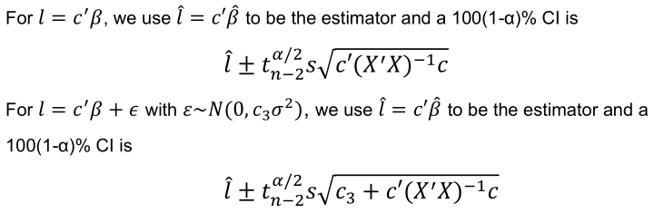

# Traffic-LinReg-Modelling
This data is about traffic monitoring. One of the most important traffic monitoring variables is the average annual daily traffic (aadt) for a section of road or highway. 
It is defined as the average, over a year, of the number of vehicles that pass through a particular section of a road each day.

Consider the first column (aadt) of the data to be the response, and

X1: population of county in which road section in located--the second column of data;

X2: number of lanes in road section-- the third column of data ;

X3: width of road section (in feet)-the fourth column of data;

Control (X4): two-category quality variable indicating whether or not there is control of access to road section (1=access control; 0=no access control). 

# 1. Graphic display of the observed data
First, we import the data in a dataframe and plot a scatter plot matrix and correlation
matrix.

There is a relationship between y and x1, x2 and x1, x2, x3 and x4 do not seem to be correlated to each other. 

# 2. Modeling multiple linear regression with R
Using lm function to do MLR,

The fitted model is y=-26040+0.033X1+9158X2+100.3X3+23610X4.

# 3. Adequacy of fitted model
## 3.1 Based on the fitted model
From the t-tests, X3 seems to be insignificant as Pr(>|t|)=0.421>0.05.
The F-statistic shows 88.29 on 4 and 116 DF with p-value: < 2.2e-16. The small p-value indicates that the SLR model is adequate.
The multiple R-squared is 0.7527 which means based on the fitted model, the exploratory variables in the data set can explain 75% of the variation in response variable.

## 3.2 Based on residuals
### 3.2.1 Normal Q-Q plot
Looking at the normal Q-Q plot below, the plot seems good as most of the points fall close to the line but with 2 outlier points.

### 3.2.2 Residual plots
Looking at the residual plots to check for time effects, non-constant variance and higher order curvatures, we see that the residual vs fitted value plot shows a quadratic trend, indicating a non-linear regression function with non-constant variance. Thus we should consider applying transformations to the data set.

Applying square root transform to our y values and fitting a new mlr model, we get the following model. We observe that R-squared has increased to 0.8568 from 0.7527 which means the exploratory variables better explain the variation in response variable in this model. X3 is still insignificant. The residual plots now look evenly spread and random.

### 4.2.3 Sequential dependence
Durbin-Watson test is used to check for possible sequential dependence. We reject the null hypothesis thus there is no sequential dependence.

# 4. F-test for reduced model and full model
## 4.1 Test for whether some coefficients are zeros
From the results of MLR1, we can see that predictor X3 is not significant, i.e. it may be equal to zero. Hence, we may want to test the following hypothesis,

Conclusion: We cannot reject the null hypothesis at the significance level of 0.05. 
Thus, we remove X3 and perform MLR again. We see that in the reduced model, all the variables are significant, the F-statistic is larger value than the previous model and the model is a good fit with an R-squared value of 0.8565. The residual plots all look random and spread out as well.
The new fitted model is √y=84.84+0.000095X1+32.86X2-57.22X4.

# 5 Prediction

The prediction value for x1=50000, x2=3, x4=2 is y=35420.55. 

